# Sidebar Menu using HTML and CSS

## The sidebar menu

The second project for sidebar menu for webpage. 

## Preview

<figure>
    
    <figcaption>Here's the project we create for this tutorial project.</figcaption>
</figure>

## Start the Sidbar Creation

First, we need to create the files for the project for HTML file and the CSS file and the assets of the webpage project.

<figure>
    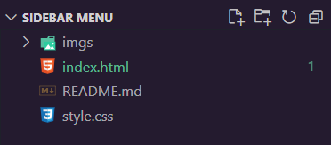
    <figcaption>The starter files for the web project</figcaption>
</figure>

## Create HTML and CSS for Sidebar

The first file we create for html files is the boilerplate. Simply type (`!`) to VS Code IDE if you use this. The method you did when you type `!` this on the keyboard is called Emmet.

<figure>
    
    <figcaption></figcaption>
</figure>

Change the title of the project we create. From the **Document** to **Side Menu Bar**.

```
<!DOCTYPE html>
<html lang="en">
<head>
    <meta charset="UTF-8">
    <meta name="viewport" content="width=device-width, initial-scale=1.0">
    <title>Side Menu Bar</title>
</head>
    <body>
        
    </body>
</html>
```

Use [Font-Awesome](https://cdnjs.com/libraries/font-awesome) For your logos of your website. Make you you should copy the latest version.

<figure>
    
    <figcaption></figcaption>
</figure>

This website works for the Icons for the project we create.

```
<link rel="stylesheet" href="https://cdnjs.cloudflare.com/ajax/libs/font-awesome/6.5.2/css/all.min.css" integrity="sha512-SnH5WK+bZxgPHs44uWIX+LLJAJ9/2PkPKZ5QiAj6Ta86w+fsb2TkcmfRyVX3pBnMFcV7oQPJkl9QevSCWr3W6A==" crossorigin="anonymous" referrerpolicy="no-referrer" />
```

Then, apply it to your project in the head section.

```
<!DOCTYPE html>
<html lang="en">
<head>
    <meta charset="UTF-8">
    <meta name="viewport" content="width=device-width, initial-scale=1.0">
    <link rel="stylesheet" href="https://cdnjs.cloudflare.com/ajax/libs/font-awesome/6.5.2/css/all.min.css" integrity="sha512-SnH5WK+bZxgPHs44uWIX+LLJAJ9/2PkPKZ5QiAj6Ta86w+fsb2TkcmfRyVX3pBnMFcV7oQPJkl9QevSCWr3W6A==" crossorigin="anonymous" referrerpolicy="no-referrer" />
    <title>Side Menu Bar</title>
</head>
    <body>
        
    </body>
</html>
```

Create the `div` for the `title` and the `item` of the project webpage. Create a `<header></header>` element. The content of header named **My App**.

```
<!DOCTYPE html>
<html lang="en">
<head>
    <!-- snip -->
</head>
    <body>
        <div class="sidebar">
            <header>My App</header>
        </div>
    </body>
</html>
```

<figure>
    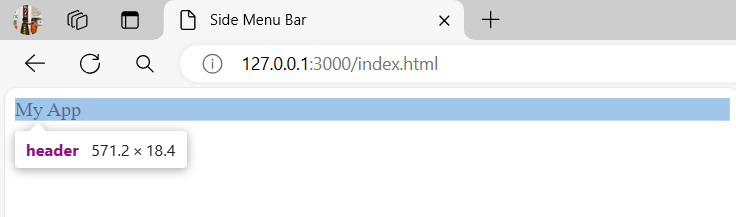
    <figcaption>The header element with the content which is highlighted blue</figcaption>
</figure>

If you want to search logo for your webpage icons, here's the link and click this [Font-Awesome Icon](https://fontawesome.com/icons)

<figure>
    
    <figcaption></figcaption>
</figure>

Next, create the `ul` (unordered list) with the items of the following:

- **QR code** (`<i class="fa-solid fa-qrcode"></i>`)
- **Link** (`<i class="fa-solid fa-link"></i>`)
- **Stream** (`<i class="fa-solid fa-bars-staggered"></i>`)
- **Calendar Week** (`<i class="fa-solid fa-calendar-week"></i>`)
- **Question Circle** (`<i class="fa-regular fa-circle-question"></i>`)
- **Sliders** (`<i class="fa-solid fa-sliders"></i>`)
- **Envelope** (`<i class="fa-solid fa-envelope"></i>`)

```
<!DOCTYPE html>
<html lang="en">
<head>
    <!-- snip -->
</head>
    <body>
        <div class="sidebar">
            <header>My App</header>
            <ul>
                <li><a href="#"><i class="fas fa-qrcode"></i></a></li>
                <li><a href="#"><i class="fa-solid fa-link""></i></a></li>
                <li><a href="#"><i class="fa-solid fa-bars-staggered"></i></a></li>
                <li><a href="#"><i class="fa-solid fa-calendar-week"></i></a></li>
                <li><a href="#"><i class="fa-regular fa-circle-question"></i></a></li>
                <li><a href="#"><i class="fa-solid fa-sliders"></i></a></li>
                <li><a href="#"><i class="fa-solid fa-envelope"></i></a></li>
            </ul>
        </div>
    </body>
</html>
```

<figure>
    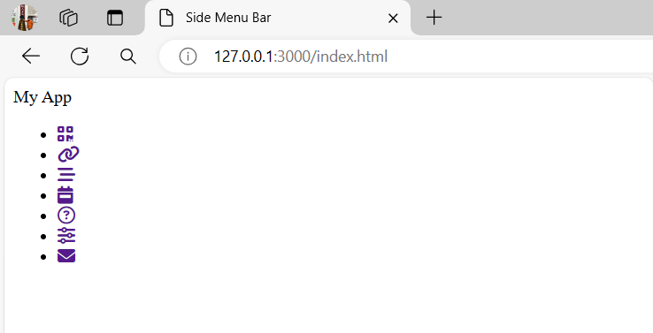
    <figcaption>The menu icons for the user.</figcaption>
</figure>

Next is the type the name for the menu icons. This code represents a list of items in a navigation menu. Each item consists of an icon followed by a text link. The icons are from different icon libraries like Font Awesome. The text links correspond to different sections like "Dashboard," "Shortcuts," "Overview," etc.

```
<!DOCTYPE html>
<html lang="en">
<head>
    <!-- snip -->
</head>
    <body>
        <div class="sidebar">
            <header>My App</header>
            <ul>
                <li><a href="#"><i class="fas fa-qrcode"></i>Dashboard</a></li>
                <li><a href="#"><i class="fa-solid fa-link"></i>Shortcuts</a></li>
                <li><a href="#"><i class="fa-solid fa-bars-staggered"></i>Overview</a></li>
                <li><a href="#"><i class="fa-solid fa-calendar-week"></i>Events</a></li>
                <li><a href="#"><i class="fa-regular fa-circle-question"></i>About</a></li>
                <li><a href="#"><i class="fa-solid fa-sliders"></i>Services</a></li>
                <li><a href="#"><i class="fa-solid fa-envelope"></i>Contact</a></li>
            </ul>
        </div>
    </body>
</html>
```

<figure>
    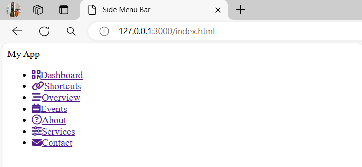
    <figcaption>The icons with the name</figcaption>
</figure>

Link the CSS code to HTML for the style functionality.

```
<!DOCTYPE html>
<html lang="en">
<head>
    <meta charset="UTF-8">
    <meta name="viewport" content="width=device-width, initial-scale=1.0">
    <link rel="stylesheet" href="https://cdnjs.cloudflare.com/ajax/libs/font-awesome/6.5.2/css/all.min.css" integrity="sha512-SnH5WK+bZxgPHs44uWIX+LLJAJ9/2PkPKZ5QiAj6Ta86w+fsb2TkcmfRyVX3pBnMFcV7oQPJkl9QevSCWr3W6A==" crossorigin="anonymous" referrerpolicy="no-referrer" />
    <title>Side Menu Bar</title>
    <link rel="stylesheet" href="style.css">
</head>
    <body>
        <!-- snip -->
    </body>
</html>
```

In CSS file, we need to import the online font using `@import url()` fonts from google fonts using `Roboto` fonts. This CSS code is importing a Google Font called "Roboto". The `@import` rule is used to import external CSS stylesheets. The URL provided is a link to the Google Fonts API, which fetches the CSS styles for the "Roboto" font with various weights and styles. The `display=swap` parameter ensures that the font is displayed immediately while it is being fetched.

```
https://fonts.googleapis.com/css2?family=Roboto:ital,wght@0,100;0,300;0,400;0,500;0,700;0,900;1,100;1,300;1,400;1,500;1,700;1,900&display=swap
```

The **CSS** code:

```
@import url("https://fonts.googleapis.com/css2?family=Roboto:ital,wght@0,100;0,300;0,400;0,500;0,700;0,900;1,100;1,300;1,400;1,500;1,700;1,900&display=swap");
```

Now, for the `body` in HTML file. Style the font for the entire webpage. This CSS code sets the font family of the body element to "Roboto", with a fallback to a generic sans-serif font if "Roboto" is not available.

```
body {
    font-family: "Roboto", sans-serif;
}
```

Style the entire webpage using `*` symbol.

```
* {
    margin: 0;
    padding: 0;
    list-style: none;
    text-decoration: none;
}
```

<figure>
    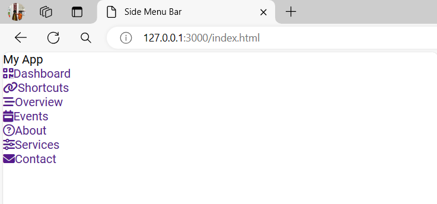
    <figcaption>Everything has changed when we use the * of styling of `ul`</figcaption>
</figure>

Design the sidebar of the project. This CSS code defines the styling for a sidebar element. It sets the `position` of the sidebar to `fixed`, meaning it will stay in the same position even when the page is scrolled. It is aligned to the left side of the page, has a `width` of `250 pixels`, and spans the full `height` of the page. The `background color` is set to `#042331`.

```
.sidebar {
    position: fixed;
    left: 0;
    width: 250px;
    height: 100%;
    background: #042331;;
}
```

<figure>
    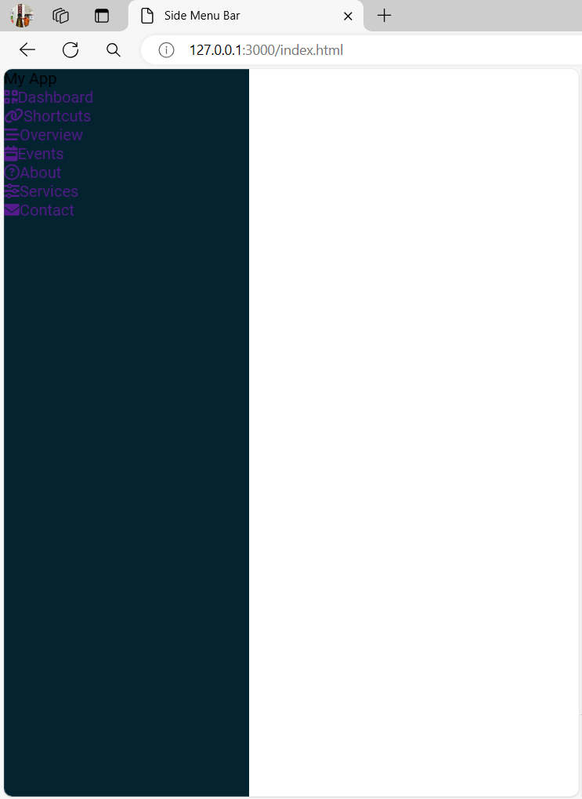
    <figcaption>The sidebar you see in the left.</figcaption>
</figure>

Style under the `sidebar` which is the `.header`. This CSS code defines the styling for the header element inside the sidebar. It sets the `font size` to `22 pixels`, the text `color` to `white`, centers the text, sets the `line height` to `70 pixels`, sets the `background` color to `#063146`, and disables text selection on the header element.

```
.sidebar header {
    font-size: 22px;
    color: white;
    text-align: center;
    line-height: 70px;
    background: #063146;
    user-select: none;
}
```

<figure>
    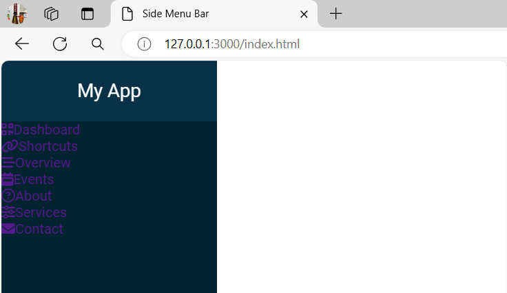
    <figcaption>The design of title header is good!</figcaption>
</figure>

This code styles the anchor tags (`a`) inside an unordered list (`ul`) within an element with the class `sidebar`. It sets the anchor tags to be block elements with 100% height and width, a line height of 65px, a font size of 20px, white text color, 40px padding on the left, and a top border of 1px solid slightly transparent white and a bottom border of 1px solid black.

```
.sidebar ul a {
    display: block;
    height: 100%;
    width: 100%;
    line-height: 65px;
    font-size: 20px;
    color: white;
    padding-left: 40px;
    box-sizing: border-box;
    border-top: 1px solid rgba(255, 255, 255, .1);
    border-bottom: 1px solid black;
}
```

<figure>
    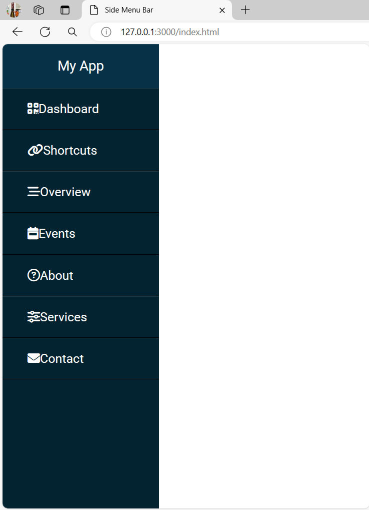
    <figcaption>The Design of every items is very good and professional look</figcaption>
</figure>

This CSS code targets the `<a>` element inside a `<li>` element that is being hovered over. It increases the left padding of the `<a>` element to 50 pixels when the `<li>` element is being hovered over.

```
ul li:hover a {
    padding-left: 50px;
}
```

<figure>
    
    <figcaption>When you hover the items without transition</figcaption>
</figure>

This code sets a `transition` effect with a duration of `0.4 seconds`.

```
.sidebar ul a {
    display: block;
    height: 100%;
    width: 100%;
    line-height: 65px;
    font-size: 20px;
    color: white;
    padding-left: 40px;
    box-sizing: border-box;
    border-top: 1px solid rgba(255, 255, 255, .1);
    border-bottom: 1px solid black;
    transition: .4s; // new code!
}
```

<figure>
    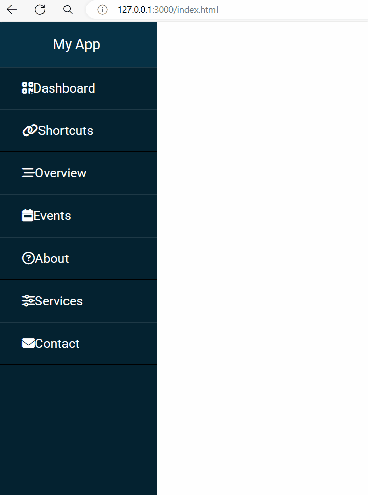
    <figcaption>The hover with transition.</figcaption>
</figure>

Style these icons in margin. This CSS code targets the `<i>` elements that are descendants of `<a>` elements inside `<ul>` elements inside the .sidebar class. It adds a right margin of 16px to these `<i>` elements. This is used to create some spacing between the icon and the text of the menu items.

<figure>
    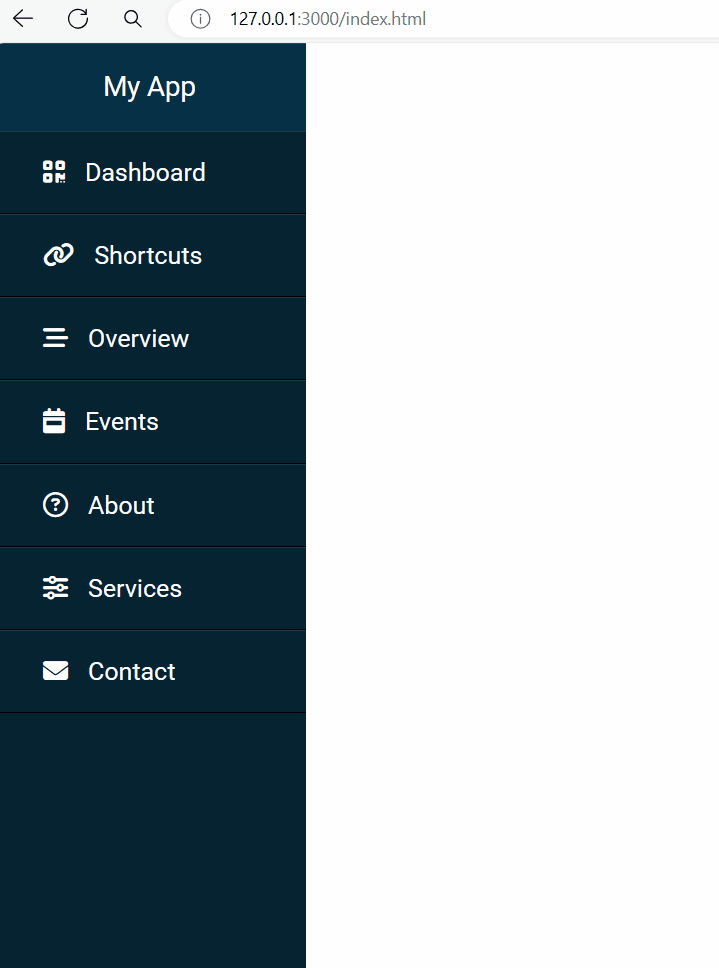
    <figcaption>The icon margins to the right is working!</figcaption>
</figure>

This code is an HTML markup that creates a checkbox input element with the id "check" and a label associated with it. This code creates a checkbox input with an associated label. When the checkbox is checked, it shows a "bars" icon, and when unchecked, it shows a "xmark" icon.

```
<input type="checkbox" id="check">
    <label for="check">
        <i class="fa-solid fa-bars" id="btn"></i>
        <i class="fa-solid fa-xmark" id="cancel"></i>
    </label>
```

<figure>
    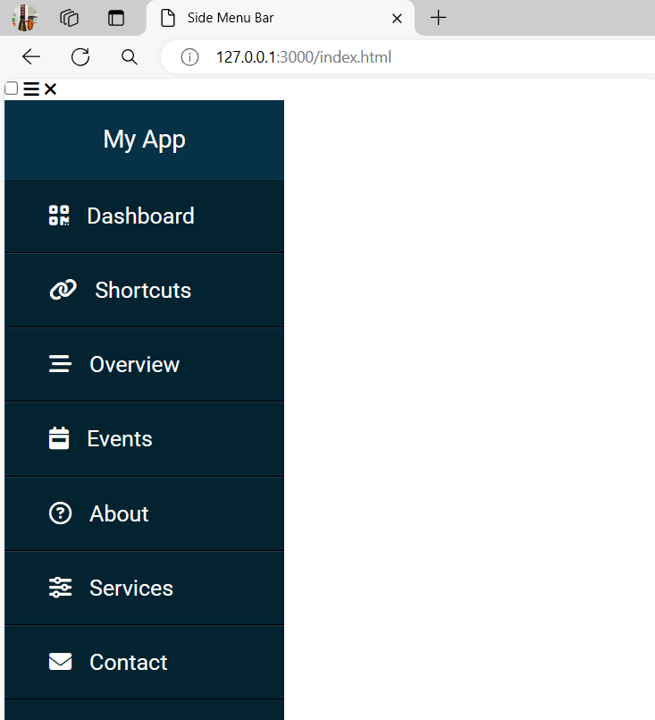
    <figcaption>The checkbox located on the top-left with the icon of x and the bar</figcaption>
</figure>

This CSS code targets an element with the id "check" and hides it by setting its `display` property to "none".

```
#check {
    display: none;
}
```

<figure>
    
    <figcaption>The checkbox is hiden you can click</figcaption>
</figure>

This CSS code selects the elements with the IDs "btn" and "cancel" that are descendants of a "label" element. It sets the position of these elements to "absolute" and changes the cursor to "pointer" when hovering over them.

<figure>
    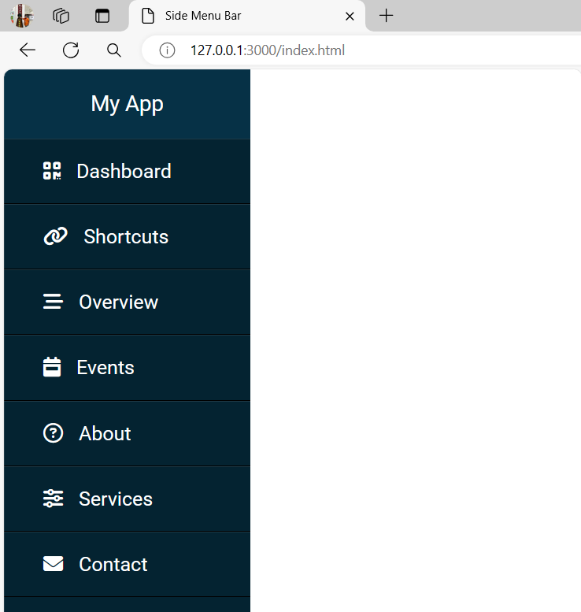
    <figcaption>The icon of bars and x is hidden</figcaption>
</figure>

This CSS code styles the element with the ID "btn" that is a descendant of a label element. It sets the left position to 40 pixels, the top position to 25 pixels, the font size to 35 pixels, and the color to white.

```
label #btn {
    left: 40px;
    top: 25px;
    font-size: 35px;
    color: white;
}
```

Next, is to `.sidebar`. This CSS code snippet defines the styling for a sidebar element. It sets the position of the sidebar to be fixed, meaning it will stay in the same position even when the page is scrolled. The sidebar is positioned 250 pixels to the left of its normal position. It has a width of 250 pixels and a height that spans the entire height of its parent element. The background color of the sidebar is set to #042331.

<figure>
    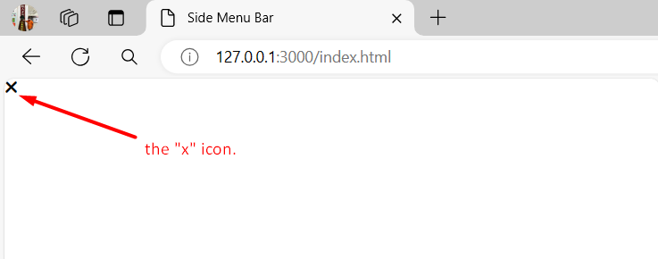
    <figcaption>The sidebar is gone.</figcaption>
</figure>

This CSS code defines styles for two elements with the IDs "btn" and "cancel" that are children of a label element. The elements have absolute positioning, a cursor style of pointer, a background color of #042331, and a border-radius of 3px. The element with the ID "btn" also has additional styles such as a left position of 40px, a top position of 25px, a font size of 35px, a text color of white, and padding of 6px 12px.

```
label #btn, label #cancel {
    position: absolute;
    cursor: pointer;
    background: #042331;
    border-radius: 3px;
}

label #btn {
    left: 40px;
    top: 25px;
    font-size: 35px;
    color: white;
    padding: 6px 12px;
}
```

<figure>
    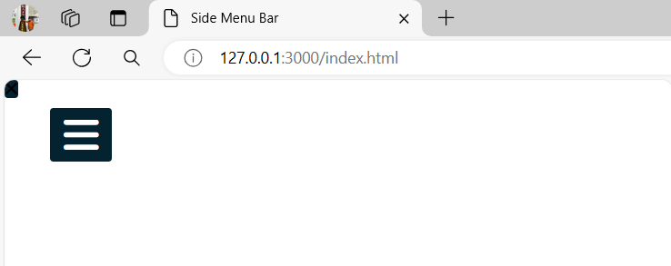
    <figcaption>The button is big for the website.</figcaption>
</figure>

This code snippet targets an element with the id of 'cancel' inside a label element. It sets the `z-index` to `1111`, positions it `195px` from the `left` and `17px` from the `top`, gives it a `font size` of `30px`, a color of `#0a5275`, and `padding` of `4px` on the top and bottom, and `9px` on the left and right.

```
label #cancel {
    z-index: 1111;
    left: 195px;
    top: 17px;
    font-size: 30px;
    color: #0a5275;
    padding: 4px 9px;
}
```

<figure>
    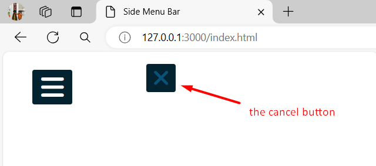
    <figcaption>The cancel button design is good</figcaption>
</figure>

This CSS code is using the adjacent sibling selector (~) to target the `.sidebar `element that comes after the `#check` element when it is checked. When the `#check` checkbox is checked, the left property of the `.sidebar` element is set to 0, which means it will be positioned at the left edge of its parent container.

```
#check:checked ~ .sidebar {
    left: 0;
}
```

<figure>
    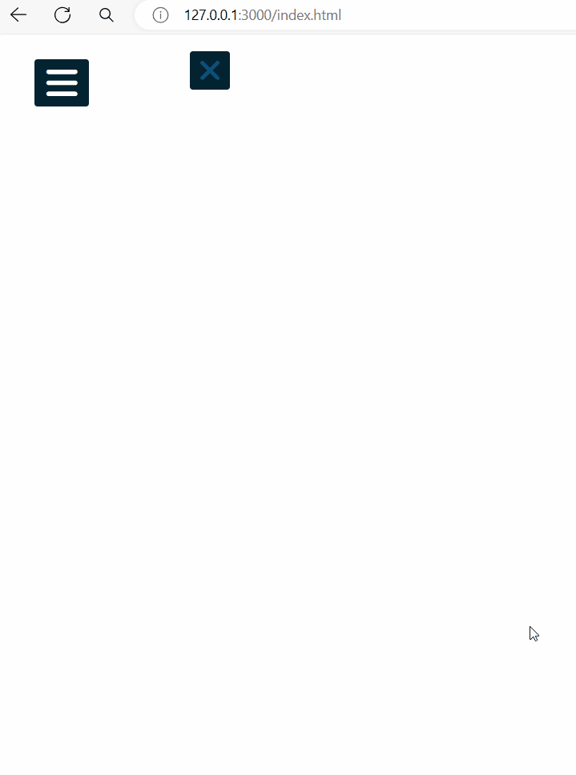
    <figcaption>Once, you click the cancel button, the sidebar will disappear.</figcaption>
</figure>


```
.sidebar {
    position: fixed;
    left: -250px; 
    width: 250px;
    height: 100%;
    background: #042331;
    transition: all .5s ease;
}
```

This code styles an element with the class "sidebar" by fixing its position on the viewport, setting its initial left position off-screen by 250px, giving it a width of 250px, a height of 100% of the viewport height, a dark background color of #042331, and animating its properties with a smooth transition over 0.5 seconds.

```
.sidebar {
    position: fixed;
    left: -250px; 
    width: 250px;
    height: 100%;
    background: #042331;
    transition: all .5s ease;
}
```

<figure>
    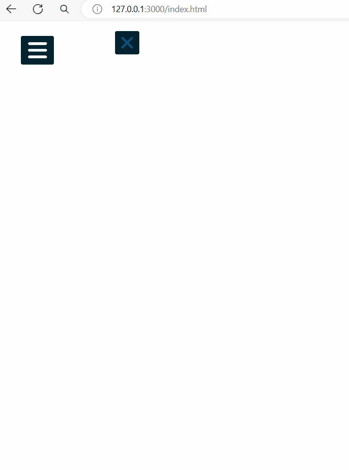
    <figcaption>The cancel button and the sidebar</figcaption>
</figure>

This CSS code targets the element with the ID "btn" that is a descendant of a label element, which is a sibling of an input element with the ID "check". When the input element is checked (i.e., selected), the targeted element will have its left position set to 250 pixels, its opacity set to 0, and its pointer events disabled.

```
#check:checked ~ label #btn {
    left: 250px;
    opacity: 0;
    pointer-events: none;
}
```

This CSS code targets the element with the ID "btn" that is a descendant of a label element, which is a sibling of an input element with the ID "check". When the input element is checked (i.e., selected), the targeted element will have its left position set to 250 pixels, its opacity set to 0, and its pointer events disabled.

```
#check:checked ~ label #btn {
    left: 250px;
    opacity: 0;
    pointer-events: none;
}
```

<figure>
    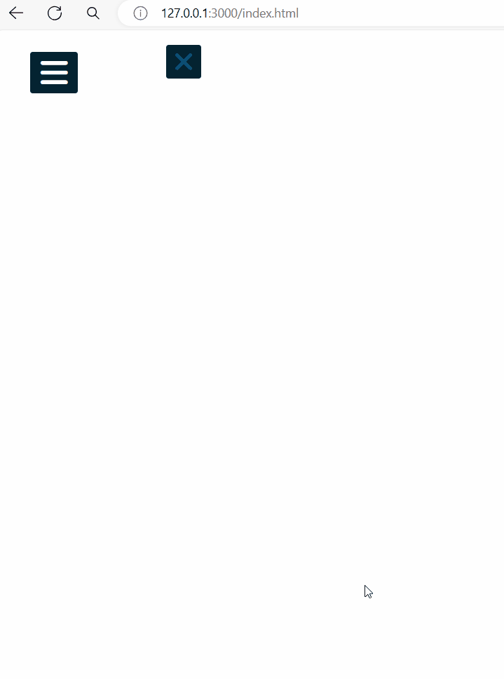
    <figcaption>The cancel button and the sidebar</figcaption>
</figure>

This CSS code defines the style for an element with the ID `btn` that is a descendant of a `label` element. It positions the element 40 pixels from the left and 25 pixels from the top of its containing element. It sets the font size to 35 pixels, the text color to white, and the padding to 6 pixels on the top and bottom, and 12 pixels on the left and right. It also adds a transition effect for all properties over a duration of 0.5 seconds.

```
label #btn {
    left: 40px;
    top: 25px;
    font-size: 35px;
    color: white;
    padding: 6px 12px;
    transition: all .5s;
}
```

<figure>
    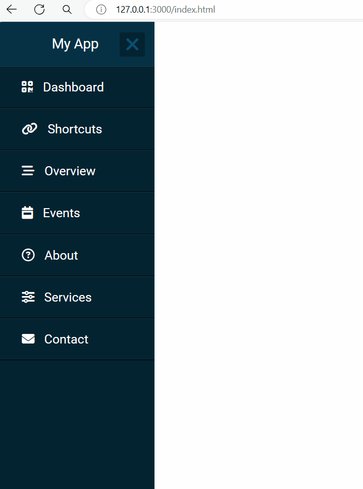
    <figcaption>You see the transition of bar button and sidebars</figcaption>
</figure>

This CSS code styles an element with the id "cancel" inside a label. It sets the z-index to 1111, positions it to the left with a negative margin, specifies the top position, sets the font size, color, and padding for the element.

```
label #cancel {
    z-index: 1111;
    left: 195px;
    top: 17px;
    font-size: 30px;
    color: #0a5275;
    padding: 4px 9px;
}
```

<figure>
    
    <figcaption>You see the transition of bar button and sidebars</figcaption>
</figure>

This CSS code targets the element with the ID "cancel" that is a descendant of a label element, which is a sibling of an input element with the ID "check". When the input element is checked (i.e., selected), the targeted element will have its left position set to 250 pixels, its opacity set to 0, and its pointer events disabled.

```
#check:checked ~ label #cancel  {
    left: 250px;
    opacity: 0;
    pointer-events: none;
}
```

<figure>
    
    <figcaption></figcaption>
</figure>

This CSS code sets the left position of an element to -195 pixels from the left edge of its containing element.

```
label #cancel {
    z-index: 1111;
    left: -195px; // code!
    top: 17px;
    font-size: 30px;
    color: #0a5275;
    padding: 4px 9px;
}
```

<figure>
    
    <figcaption>The cancel button is still here.</figcaption>
</figure>

This CSS code targets the element with the ID "cancel" that is a descendant of a label element, which is a sibling of an input element with the ID "check" when the input element is checked. It sets the left property of the "cancel" element to 195 pixels.

```
#check:checked ~ label #cancel  {
    left: 195px;
}
```

<figure>
    
    <figcaption>When you click the bar button, the cancel button will appear.</figcaption>
</figure>

This CSS code snippet defines the styling for the `#cancel` element that is a descendant of a `label` element.

- `z-index: 1111;` sets the stacking order of the element, with a higher value meaning it will be displayed on top of other elements.

- `left: -195px;` moves the element 195 pixels to the left of its normal position.

- `top: 17px;` moves the element 17 pixels down from its normal position.

- `font-size: 30px;` sets the font size of the element to 30 pixels.

- `color: #0a5275;` sets the text color of the element to the hexadecimal color code #0a5275.

- `padding: 4px 9px;` adds 4 pixels of padding to the top and bottom, and 9 pixels of padding to the left and right of the element.

- `transition: all .5s ease;` This CSS code sets a transition effect on all CSS properties of an element. The transition duration is set to 0.5 seconds (0.5s) and the timing function is set to "ease" (ease), which means the transition will start slowly, accelerate in the middle, and then slow down again before completing.

```
label #cancel {
    z-index: 1111;
    left: -195px;
    top: 17px;
    font-size: 30px;
    color: #0a5275;
    padding: 4px 9px;
    transition: all .5s ease;
}
```

<figure>
    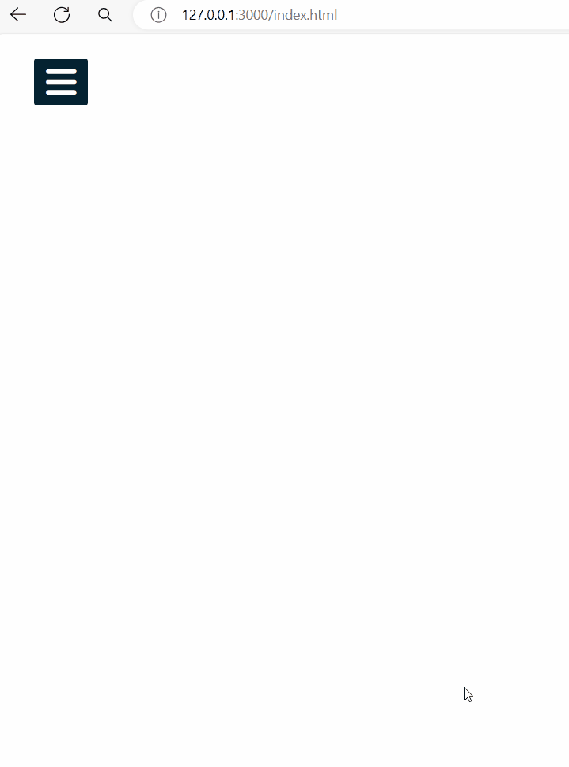
    <figcaption>The cancel button appear</figcaption>
</figure>

This code represents an empty section element in HTML. It is used to divide the content of a webpage into sections for styling or scripting purposes.

```
</head>
    <body>
        <input type="checkbox" id="check">
        <label for="check">
            <!-- snip -->
        </label>
        <div class="sidebar">
            <header>My App</header>
            <ul>
                <!-- snip -->
            </ul>
        </div>
        <section></section>
    </body>
</html>
```

This CSS code styles a `section` element. It sets the background image of the section to an image located at `./imgs/coeplan.jpg`. The image is centered and covers the entire section. The height of the section is set to 100% of the viewport height.

```
section {
    background: url(./imgs/coeplan.jpg) no-repeat;
    background-position: center;
    background-size: cover;
    height: 100vh;
}
```

<figure>
    
    <figcaption></figcaption>
</figure>

This CSS code targets the section element that comes after an element with the ID check when the check element is checked. It sets the `left margin` of the section element to `250 pixels`.

```
#check:checked ~ section {
    margin-left: 250px;
}
```

This CSS code snippet is defining the styling for the `<section>` HTML element.

- `background: url(./imgs/coeplan.jpg) no-repeat;` sets the background image of the section to be coeplan.jpg located in the imgs directory. The no-repeat property ensures that the image does not repeat.

- `background-position: center;` centers the background image.

- `background-size: cover;` ensures that the background image covers the entire section, potentially cropping parts of the image if necessary.

- `height: 100vh;` sets the height of the section to be 100% of the viewport height.

- `transition: all .5s;` adds a smooth transition effect to all CSS properties of the section when they change over a duration of 0.5 seconds.

```
section {
    background: url(./imgs/coeplan.jpg) no-repeat;
    background-position: center;
    background-size: cover;
    height: 100vh;
    transition: all .5s;
}
```

<figure>
    
    <figcaption>The final project goes here. The project finally works.</figcaption>
</figure>

The project is done! **Congratulations!!!** 🎊🎉