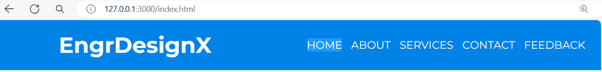

# Responsive Navigation Bar using HTML and CSS

Here's the project about Responsive Navigation Bar using HTML and CSS. This is great opportunity to learn how build the webpage. And thanks to CodeNepal to teach me a techniques to learn this.

## Preview
<figure>
    
    <figcaption>This project we want to create this tutorial</figcaption>
</figure>


## Start Creation (HTML &)

The first file we create for html files is the boilerplate. Simply type (**!**) to VS Code IDE if you use this. The method you did when you type `!` this on the keyboard is called **Emmet**.

<figure>
    
    <figcaption>This template is the first code you learn</figcaption>
</figure>

Change the title from the default `Document` to `Response Navbar` and link the CSS file to html file using `link` to `style.css` file.

```
<!DOCTYPE html>
<html lang="en">
<head>
    <meta charset="UTF-8">
    <meta name="viewport" content="width=device-width, initial-scale=1.0">
    <title>Response Navbar</title>
    <link rel="stylesheet" href="style.css">
</head>
    <body>
        
    </body>
</html>
```

Create the `nav` element for you webpage project. The `nav` means the navigation of the project on the `body` part.

```
<!DOCTYPE html>
<html lang="en">
<head>
    <!-- snip -->
</head>
    <body>
        <nav>
            
        </nav>
    </body>
</html>
```

Next is to create a `label` element with the class named `logo` and the name of the content of the `label` is **EngrDesignX**. This code is written in HTML and it creates a label element with the class "logo". The text inside the label is "EngrDesignX".

```
<!DOCTYPE html>
<html lang="en">
<head>
    <!-- snip -->
</head>
    <body>
        <nav>
            <label class="logo">EngrDesignX</label>
        </nav>
    </body>
</html>
```

Create the `ul` (unordered list) element for the menus for the user. Every items, it has `a` anchor element. This is an HTML code that represents an unordered list (`<ul>`) with five list items (`<li>`). Each list item contains a hyperlink (`<a>`) with a text label. The hyperlinks all point to the same location ("#"), which is typically used as a placeholder for JavaScript functionality.

```
<!DOCTYPE html>
<html lang="en">
<head>
    <!-- snip -->
</head>
    <body>
        <nav>
            <label class="logo">EngrDesignX</label>
            <ul>
                <li><a href="#">Home</a></li>
                <li><a href="#">About</a></li>
                <li><a href="#">Services</a></li>
                <li><a href="#">Contact</a></li>
                <li><a href="#">Feedback</a></li>
            </ul>
        </nav>
    </body>
</html>
```

<figure>
    
    <figcaption>Here's the first project you see here.</figcaption>
</figure>


In CSS, It is what we need to design first. This CSS code sets default styles for all elements on a webpage. It removes padding, margin, text decoration, list styling, and sets the box model to border-box.

```
* {
    padding: 0;
    margin: 0;
    text-decoration: none;
    list-style: none;
    box-sizing: border-box;
}
```

<figure>
    
    <figcaption>After the designing of the webpage and here's the result</figcaption>
</figure>

Next, is to style the body. And use `@import url()` to import the online based font.

Here's the font you want to use in this webpagel. 

This CSS code sets the font family of the body element to **Montserrat** if available, otherwise it falls back to the generic `sans-serif` font.

```
https://fonts.googleapis.com/css2?family=Montserrat:ital,wght@0,100..900;1,100..900&display=swap
```

```
@import url("https://fonts.googleapis.com/css2?family=Montserrat:ital,wght@0,100..900;1,100..900&display=swap");

body {
    font-family: "Montserrat", sans-serif;
}
```

<figure>
    
    <figcaption></figcaption>
</figure>

Apply the background color for the `nav` and adjust its height to 80px and then the width is 100%. In this CSS code defines the styling for the `<nav>` element in a web page. It sets the background color to #0082e6, which is a shade of blue, and sets the `height` to `80px` and the `width` to `100%`, making the navigation bar span the entire width of its container.

```
nav {
    background-color: #0082e6;
    height: 80px;
    width: 100%;
}
```

<figure>
    
    <figcaption>The design of navigation and the width and the height of the nav</figcaption>
</figure>

To style the logo in realistic through this CSS code styles a label element with the class "logo". It sets the `text color` to `white`, the `font size` to `35 pixels`, the `line height` to `80 pixels`, adds `padding` of `0 pixels` on the top and bottom and `100 pixels` on the left and right, and makes the `font weight` to `bold`.

```
label.logo {
    color: white;
    font-size: 35px;
    line-height: 80px;
    padding: 0 100px;
    font-weight: bold;
}
```

<figure>
    
    <figcaption>The style logo looks beautiful. It's like a realistic company logo</figcaption>
</figure>

Let's style the `ul` (unordered list) under the `nav` element. In this CSS code styles the unordered list (`<ul>`) that is a child of the `<nav>` element. It `floats` the list to the `right` side of its container, and adds a `right margin` of `20 pixels`. This is commonly used to create a navigation menu that aligns to the right side of the page.

```
nav ul {
    float: right;
    margin-right: 20px;
}
```

<figure>
    
    <figcaption>Have you seen the margin on the right? That 20 pixels of margin to the right for `ul` unordered list.</figcaption>
</figure>

Style the `li` under of the `ul` element and this is the code. This CSS code styles the `<li>` elements that are children of an `<ul>` element that is a child of a `<nav>` element.

- `display: inline-block`; makes the `<li>` elements appear inline, but they still have their own block-level box.

- `line-height: 80px`; sets the vertical distance between the top and bottom of each `<li>` element to be 80 pixels.

- `margin: 0 5px`; adds a margin of 5 pixels on the left and right sides of each `<li>` element.

```
nav ul li {
    display: inline-block;
    line-height: 80px;
    margin: 0 5px;
}
```

<figure>
    
    <figcaption>This is the styled li (items). Have you seen the brown highlighted? That's the margin left and right with the value of 5 pixels</figcaption>
</figure>

Next is to style the `a` (anchor) element to adjust the font-size the font-color and the transform to uppercase. This CSS code snippet styles the anchor elements (`<a>`) that are descendants of list items (`<li>`) within an unordered list (`<ul>`) that is a descendant of a `<nav>` element. It sets the `text color` to `white`, the `font size` to `17` pixels, and `transforms the text` to `uppercase`.

```
nav ul li a {
    color: white;
    font-size: 17px;
    text-transform: uppercase;
}
```

<figure>
    
    <figcaption>The styled navigator for such as the logo and the menus for the user</figcaption>
</figure>


In HTML file, add the class name `active` for *Home*

```
<body>
    <nav>
        <label class="logo">EngrDesignX</label>
        <ul>
            <li><a class="active" href="#">Home</a></li>
            <li><a href="#">About</a></li>
            <li><a href="#">Services</a></li>
            <li><a href="#">Contact</a></li>
            <li><a href="#">Feedback</a></li>
        </ul>
    </nav>
</body>
```

And then, after you add the `.active` for **Home**, Let's style this we need to hover it to change the color of items. This CSS code styles the `<a>` (anchor) elements that have the class name "active" or are being hovered over. It sets the background color to `#1b9bff` (a shade of blue) and adds a transition effect that lasts for 0.5 seconds.

If you want to know more about `transition` click this [transitionW3School](https://www.w3schools.com/css/css3_transitions.asp) and [MDN Transition](https://developer.mozilla.org/en-US/docs/Web/CSS/CSS_Transitions/Using_CSS_transitions)

```
a.active, a:hover{
    background: #1b9bff;
    transition: .5s;
}
```

<figure>
    
    <figcaption>Once you point the items the hovering works to set their background color with transition timer as response</figcaption>
</figure>

Adjust the padding and border radius for the `a` (anchor) as items. Through this CSS code styles the anchor elements (`<a>`) that are descendants of list items (`<li>`) within an unordered list (`<ul>`) that is a descendant of a `<nav>` element. It sets the text `color` to `white`, the `font size` to `17 pixels`, and `padding` to `7 pixels` on the top and bottom and `13 pixels` on the left and right. It also sets the border radius to 3 pixels and `transforms the text` to `uppercase`.

```
nav ul li a {
    color: white;
    font-size: 17px;
    padding: 7px 13px; // new declarator
    border-radius: 3px; // new declarator
    text-transform: uppercase;
}
```

<figure>
    
    <figcaption>The padding and the border radius of the anchor is beautiful</figcaption>
</figure>

Use [Font-Awesome](https://cdnjs.com/libraries/font-awesome) For your logos of your website. Make you you should copy the latest version.


<figure>
    
    <figcaption>This website works for the Icons</figcaption>
</figure>

```
<link rel="stylesheet" href="https://cdnjs.cloudflare.com/ajax/libs/font-awesome/6.5.2/css/all.min.css" integrity="sha512-SnH5WK+bZxgPHs44uWIX+LLJAJ9/2PkPKZ5QiAj6Ta86w+fsb2TkcmfRyVX3pBnMFcV7oQPJkl9QevSCWr3W6A==" crossorigin="anonymous" referrerpolicy="no-referrer" />
```

Then, apply it to your project in the head section.

```
<!DOCTYPE html>
<html lang="en">
<head>
    <meta charset="UTF-8">
    <meta name="viewport" content="width=device-width, initial-scale=1.0">
    <title>Response Navbar</title>
    <link rel="stylesheet" href="style.css">
    <link rel="stylesheet" href="https://cdnjs.cloudflare.com/ajax/libs/font-awesome/6.5.2/css/all.min.css" integrity="sha512-SnH5WK+bZxgPHs44uWIX+LLJAJ9/2PkPKZ5QiAj6Ta86w+fsb2TkcmfRyVX3pBnMFcV7oQPJkl9QevSCWr3W6A==" crossorigin="anonymous" referrerpolicy="no-referrer" />
</head>
```

Next, create the checkbox for the navigation. This code creates a checkbox input field with the id attribute set to "check".

```
</head>
    <body>
        <nav>
            <input type="checkbox" id="check">
            
            <label class="logo">EngrDesignX</label>
            <ul>
                <li><a class="active" href="#">Home</a></li>
                <li><a href="#">About</a></li>
                <li><a href="#">Services</a></li>
                <li><a href="#">Contact</a></li>
                <li><a href="#">Feedback</a></li>
            </ul>
        </nav>
    </body>
</html>
```

<figure>
    
    <figcaption>The checkbox is on the top left.</figcaption>
</figure>

Next, create a label for `checkbox` input and use the image for `bars`. This code is written in HTML and it creates a label element with the class "logo". The text inside the label is "EngrDesignX".

If you want to search logo for your webpage icons, here's the link and click this [Font-Awesome](https://fontawesome.com/icons)

<figure>
    
    <figcaption>Here's the same that we need in our web page</figcaption>
</figure>

```
</head>
    <body>
        <nav>
            <input type="checkbox" id="check">
            <label for="check">
                <i class="fa-solid fa-bars"></i>
            </label>
            <label class="logo">EngrDesignX</label>
            <ul>
                <li><a class="active" href="#">Home</a></li>
                <li><a href="#">About</a></li>
                <li><a href="#">Services</a></li>
                <li><a href="#">Contact</a></li>
                <li><a href="#">Feedback</a></li>
            </ul>
        </nav>
    </body>
</html>
```

<figure>
    
    <figcaption>Now it works!</figcaption>
</figure>

Now, update the `label` element as button of `checkbox` for this webpage project. Now, named the class inside the `label` called `checkBtn`.

```
</head>
    <body>
        <nav>
            <input type="checkbox" id="check">
            <label for="check" class="checkBtn">
                <i class="fa-solid fa-bars"></i>
            </label>
            <label class="logo">EngrDesignX</label>
            <ul>
                <li><a class="active" href="#">Home</a></li>
                <li><a href="#">About</a></li>
                <li><a href="#">Services</a></li>
                <li><a href="#">Contact</a></li>
                <li><a href="#">Feedback</a></li>
            </ul>
        </nav>
    </body>
</html>
```

Now, hide the `bar` and the `checkbox`. This CSS code defines two styles for two different selectors.

The first selector, `.checkBtn`, styles an element with the class name `checkBtn`. It sets the font size to 30 pixels, the color to white, floats the element to the right, sets the line height to 80 pixels, adds a right margin of 40 pixels, sets the cursor to a pointer, and hides the element by setting the display property to none.

The second selector, `#check`, styles an element with the id `check`. It also hides the element by setting the display property to none.

```
.checkBtn {
    font-size: 30px;
    color: white;
    float: right;
    line-height: 80px;
    margin-right: 40px;
    cursor: pointer;
    display: none;
}

#check {
    display: none;
}
```

<figure>
    
    <figcaption>As you can see the logo bars and the checkbox hides</figcaption>
</figure>

For the adjustment of the web, using `@media`. This code sets the font size of the logo to 30 pixels and adds a left padding of 50 pixels when the screen width is at most 952 pixels. It also sets the font size of anchor elements inside list items in the navigation to 16 pixels at the same screen width.

```
@media (max-width: 952px){
    label.logo{
        font-size: 30px;
        padding-left: 50px;
    }
    nav ul li a {
        font-size: 16px;
    }
}
```

For another adjustment of the web, using `@media`. This code contains CSS rules inside a media query for screens with a maximum width of 858 pixels. It styles elements based on this condition:

- It sets the display of elements with the class `checkBtn` to block.

- It styles the ul element by fixing its position, making it full width and full height of the viewport, setting a background color, aligning it to the center, and applying a transition effect.

- It styles the `li` elements that are children of `nav ul` by setting them to block display, adding a margin of `50 pixels` at the top and bottom, and setting the line height to `30 pixels`.

- It styles the anchor (`a`) elements that are children of `nav ul li` by setting the font size to 20 pixels.

- It styles the anchor elements on hover or when active by removing the background and changing the text color.

- It moves the `ul` element to the left edge of the screen when the element with the id `check` is checked.

```
@media (max-width: 858px) {
    .checkBtn {
        display: block;
    }
    ul{
        position: fixed;
        width: 100%;
        height: 100vh;
        background: #2c3e50;
        top: 80px;
        left: -100%;
        text-align: center;
        transition: all .5s;
    }
    nav ul li {
        display: block;
        margin: 50px 0;
        line-height: 30px;
    }

    nav ul li a {
        font-size: 20px;
    }

    a:hover, a.active {
        background: none;
        color: #0082e6;
    }
    
    #check:checked ~ ul{
        left: 0;
    }
}
```

Next, create `section` element for the background. This code creates an empty section element in HTML.

```
</head>
    <body>
        <nav>
            <input type="checkbox" id="check">
            <label for="check" class="checkBtn">
                <i class="fa-solid fa-bars"></i>
            </label>
            <label class="logo">EngrDesignX</label>
            <ul>
                <li><a class="active" href="#">Home</a></li>
                <li><a href="#">About</a></li>
                <li><a href="#">Services</a></li>
                <li><a href="#">Contact</a></li>
                <li><a href="#">Feedback</a></li>
            </ul>
        </nav>
        <section></section>
    </body>
</html>
```

This code styles a `section` element by setting a background image from the file `coe.jpg` located in the `imgs` folder, ensuring it doesn't repeat, covering the entire section, and adjusting the height to be the full viewport height minus 80 pixels.

```
section {
    background: url(./imgs/coe.jpg) no-repeat;
    background-size: cover;
    height: calc(100vh - 80px);
}
```

<figure>
    
    <figcaption>Here's the final projece for project navigation bar</figcaption>
</figure>

Once you are done, and the project works properly, congratulations! 🎉 And review this if you have a time!
