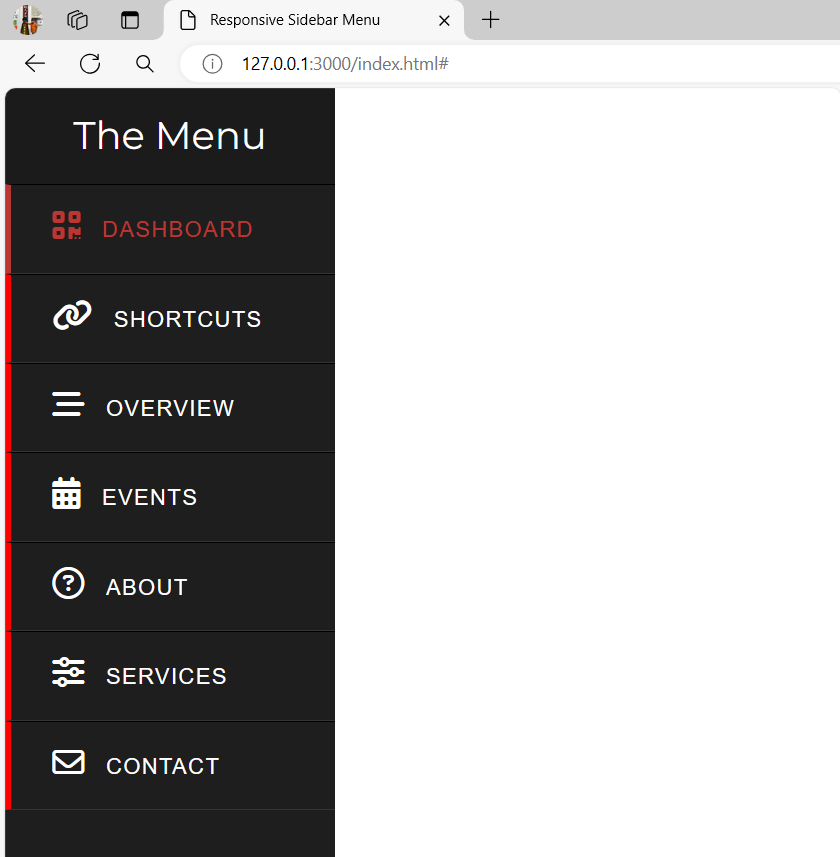
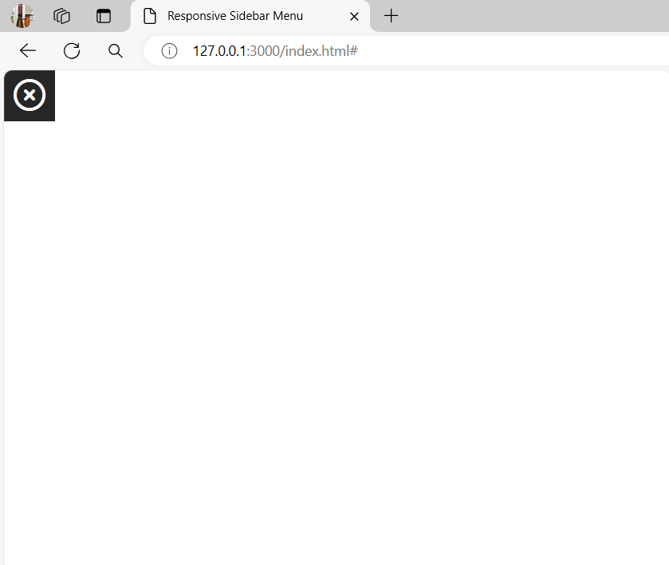
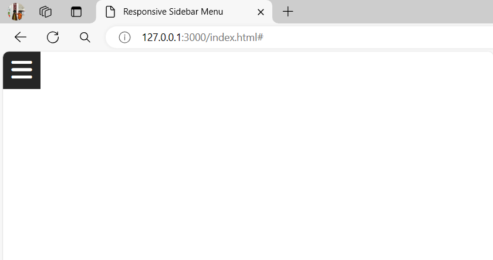

# Responsive Side Menu Bar using HTML & CSS

## The sidebar menu

The third project for sidebar menu for webpage. It is opportunity to learn this new project navigation menu.

## Preview

<figure>
    
    <figcaption>The project responsive side menu bar project is the great opportunty to build this project for the future project.</figcaption>
</figure>

## Start the Sidbar Creation

First, we need to create the files for the project for HTML file and the CSS file and the assets of the webpage project.

<figure>
    
    <figcaption>The starter files for the web project</figcaption>
</figure>

## Create HTML and CSS for Sidebar

The first file we create for html files is the boilerplate. Simply type (`!`) to VS Code IDE if you use this. The method you did when you type `!` this on the keyboard is called **Emmet**.

<figure>
    
    <figcaption>The html template for this project.</figcaption>
</figure>

Change the title of the project we create. From the **Document** to **Responsive Sidebar Menu**.

```
!DOCTYPE html>
<html lang="en">
<head>
    <meta charset="UTF-8">
    <meta name="viewport" content="width=device-width, initial-scale=1.0">
    <title>Responsive Sidebar Menu</title>
</head>
    <body>
        
    </body>
</html>
```

Use [**Font-Awesome**](https://cdnjs.com/libraries/font-awesome) For your logos of your website. Make you you should copy the latest version.

<figure>
    
    <figcaption>Copy the latest linke and paste it to your html file</figcaption>
</figure>

This website works for the Icons for the project we create.

```
<link rel="stylesheet" href="https://cdnjs.cloudflare.com/ajax/libs/font-awesome/6.5.2/css/all.min.css" integrity="sha512-SnH5WK+bZxgPHs44uWIX+LLJAJ9/2PkPKZ5QiAj6Ta86w+fsb2TkcmfRyVX3pBnMFcV7oQPJkl9QevSCWr3W6A==" crossorigin="anonymous" referrerpolicy="no-referrer" />
```

Then, apply it to your project in the head section.

```
<!DOCTYPE html>
<html lang="en">
<head>
    <meta charset="UTF-8">
    <meta name="viewport" content="width=device-width, initial-scale=1.0">
    <link rel="stylesheet" href="https://cdnjs.cloudflare.com/ajax/libs/font-awesome/6.5.2/css/all.min.css" integrity="sha512-SnH5WK+bZxgPHs44uWIX+LLJAJ9/2PkPKZ5QiAj6Ta86w+fsb2TkcmfRyVX3pBnMFcV7oQPJkl9QevSCWr3W6A==" crossorigin="anonymous" referrerpolicy="no-referrer" />
    <title>Responsive Sidebar Menu</title>
</head>
    <body>
        
    </body>
</html>
```

If you want to search logo for your webpage icons, here's the link and click this [**Font-Awesome Icon**](https://fontawesome.com/icons)

<figure>
    
    <figcaption>This website helps us to get the icons we want for the project webpage</figcaption>
</figure>

In html file inside the `body` element, create the `div` element of the items later and add the `class` attribute with the value of `sidebar`. This code is written in **HTML**. It represents the structure of a web page.

- The `<body>` element is used to contain the content of the web page.

- Inside the `<body>` element, there is a `<div>` element with the class name "sidebar". This `<div>` element can be styled or manipulated using CSS or JavaScript.

```
<!DOCTYPE html>
<html lang="en">
<head>
    <!-- snip -->
</head>
<body>
    <div class="sidebar"></div>
</body>
</html>
```

Create the `a` element with the `span` element for the project and here's the code. Here's the following text we need for the sidebar project.

- Dashboard
- Shortcuts
- Overview
- Events
- About
- Services
- Contact

This code represents a sidebar menu with links to different sections like Dashboard, Shortcuts, Overview, Events, About, Services, and Contact. Each section is represented as a clickable link in the sidebar.

```
<!DOCTYPE html>
<html lang="en">
<head>
    <!-- snip -->
</head>
<body>
    <div class="sidebar">
        <a href="#"><span>Dashboard</span></a>
        <a href="#"><span>Shortcuts</span></a>
        <a href="#"><span>Overview</span></a>
        <a href="#"><span>Events</span></a>
        <a href="#"><span>About</span></a>
        <a href="#"><span>Services</span></a>
        <a href="#"><span>Contact</span></a>
    </div>
</body>
</html>
```

<figure>
    
    <figcaption>Here's the seven anchors of the project.</figcaption>
</figure>

Next, is put the icons of every anchors of the project. And here's the following icons for the project.

- **Dashboard** (QR Code - `<i class="fa-solid fa-qrcode"></i>`)
- **Shortcuts** (Links - `<i class="fa-solid fa-link"></i>`)
- **Overview** (Stream - `<i class="fa-solid fa-bars-staggered"></i>`)
- **Events** (Calendar - `<i class="fa-solid fa-calendar-days"></i>`)
- **About** (Question Circle - `<i class="fa-regular fa-circle-question"></i>`)
- **Services** (Sliders - `<i class="fa-solid fa-sliders"></i>`)
- **Contact** (Envelope - `<i class="fa-regular fa-envelope"></i>`)


```
<!DOCTYPE html>
<html lang="en">
<head>
    <!-- snip -->
</head>
<body>
    <div class="sidebar">
        <a href="#"><i <i class="fa-solid fa-qrcode"></i><span>Dashboard</span></a>
        <a href="#"><i class="fa-solid fa-link"></i><span>Shortcuts</span></a>
        <a href="#"><i class="fa-solid fa-bars-staggered"></i><span>Overview</span></a>
        <a href="#"><i class="fa-solid fa-calendar-days"></i><span>Events</span></a>
        <a href="#"><i class="fa-regular fa-circle-question"></i><span>About</span></a>
        <a href="#"><i class="fa-solid fa-sliders"></i><span>Services</span></a>
        <a href="#"><i class="fa-regular fa-envelope"></i><span>Contact</span></a>
    </div>
</body>
</html>
```

<figure>
    
    <figcaption>You see the anchor with the logo.</figcaption>
</figure>

Link the CSS file to the `head` as a part of the webpage. And here's the code of how to link it the `style.css`. 

```
<!DOCTYPE html>
<html lang="en">
<head>
    <!-- snip -->
    <link rel="stylesheet" href="style.css"> // link css file
</head>
<body>
    <div class="sidebar">
        <!-- snip -->
    </div>
</body>
</html>
```

Add the `header` under the `body` element for the project. This CSS code defines the styling for a sidebar element. This code is written in HTML and it represents a header element with the text "The Menu" inside it. The header element is typically used to define a heading for a section of a web page.

```
<!DOCTYPE html>
<html lang="en">
<head>
    <!-- snip -->
</head>
<body>
    <div class="sidebar">
        <header>The Menu</header> // the code!
        <!-- snip -->
    </div>
</body>
</html>
```

<figure>
    
    <figcaption>The menu header you see in the black at the above of the anchors</figcaption>
</figure>

## Now Style the Elements using CSS (Cascade StyleSheet)

In CSS file, we need to import the online font using `@import url()` fonts from google fonts using `Montserrat` fonts. This CSS code is importing a Google Font called "Montserrat". The @import rule is used to import external CSS stylesheets. The URL provided is a link to the Google Fonts API, which fetches the CSS styles for the "Roboto" font with various weights and styles. The `display=swap` parameter ensures that the font is displayed immediately while it is being fetched.

```
https://fonts.googleapis.com/css2?family=Montserrat:ital,wght@0,100..900;1,100..900&display=swap
```

The CSS code:

```
@import url("https://fonts.googleapis.com/css2?family=Montserrat:ital,wght@0,100..900;1,100..900&display=swap");
```

This CSS code sets the `margin`, `padding`, and `text-decoration` properties to zero for all elements on the page.

```
* {
    margin: 0;
    padding: 0;
    text-decoration: none;
}
```

<figure>
    
    <figcaption>The margin and the padding is none and also for text decoration is not that's why every anchor's no underline</figcaption>
</figure>

Style the sidebar for the project. This code defines the styling for an element with the class "sidebar". It sets the `position` to `fixed`, `width` to `240 pixels`, `height` to `100%` of the parent element, and `background` color to a `dark gray` (#1e1e1e).

```
.sidebar {
    position: fixed;
    width: 240px;
    height: 100%;
    background: #1e1e1e;
}
```

<figure>
    
    <figcaption>The sidebar style is fixed and the color is dark gray</figcaption>
</figure>

Style the `header` of the project. This CSS code is defining the styles for the header element inside a sidebar. It sets the text `color` to `white`, the `font size` to `28 pixels`, the `line -height` to `70 pixels`, the `text alignment` to `center`, the `background` color to `#1b1b1b`, and the `font-family` to "Montserrat" with a fallback to `sans-serif`, the `user-select` to `none`.

```
.sidebar header {
    color: white;
    font-size: 28px;
    line-height: 70px;
    text-align: center;
    background: #1b1b1b;
    user-select: none;
    font-family: "Montserrat", sans-serif;
}
```

<figure>
    
    <figcaption>The menu pointers.</figcaption>
</figure>

Before (without `user-select: none`):
<figure>
    
    <figcaption>When you point using mouse to the `header` menu. The mouse pointer changes</figcaption>
</figure>

After (with `user-select: none`):
<figure>
    
    <figcaption>When you point using mouse to the `header` menu. The mouse pointer nothing change</figcaption>
</figure>

Style the `a` element under the `sidebar`. This CSS code defines the style for the anchor tags (`<a>`) within the `.sidebar` class. It sets the `display` to `block`, which means the anchor tags will take up the entire `width` of their `container`. The `color` of the text is set to `white`. The height and `line-height` are set to `65 pixels`, which determines the vertical alignment of the text. The anchor tags have a `left padding` of `30 pixels`. There is a `1-pixel solid white border at the bottom`, a `1-pixel solid black border at the top`, and a `5-pixel solid red border on the left`. The `font-family` is set to "Open Sans" with fallback to `sans-serif`.

```
.sidebar a {
    display: block;
    color: white;
    height: 65px;
    width: 100%;
    line-height: 65px;
    padding-left: 30px;
    border-bottom: 1px solid rgba(255, 255, 255, 0.1);
    border-top: 1px solid black;
    border-left: 5px solid red;
    font-family: "Open Sans", sans-serif;
}
```

<figure>
    
    <figcaption>You see the black of burder-top that's something error you need to fix</figcaption>
</figure>

Now, use the `box-sizing` CSS declarator. This CSS code sets the `box-sizing` property of an element to `border-box`. This means that the width and height of the element includes the padding and border, but not the margin.

```
.sidebar a {
    display: block;
    color: white;
    height: 65px;
    width: 100%;
    line-height: 65px;
    padding-left: 30px;
    border-bottom: 1px solid rgba(255, 255, 255, 0.1);
    border-top: 1px solid black;
    border-left: 5px solid red;
    font-family: "Open Sans", sans-serif;
    box-sizing: border-box; // the code!
}
```

<figure>
    
    <figcaption>After we use the `box-sizing` means that the width and height of the element includes the padding and border, but not the margin.</figcaption>
</figure>

Add the `class` attribute to `Dashboard`. This is an HTML code that defines a link element with the class "active" and an empty href attribute. 

```
<!DOCTYPE html>
<html lang="en">
<head>
    <!-- snip -->
</head>
<body>
    <div class="sidebar">
        <header>The Menu</header>
        <a class="active" href="#"><i <i class="fa-solid fa-qrcode"></i><span>Dashboard</span></a>
        <!-- snip -->
    </div>
</body>
</html>
```

The functionality when you hover the `a` tags and for the `a.active`. This CSS code snippet defines the styles for two selectors: `a:hover` and a.active.

- When hovering over an anchor (`<a>`) element, the left border will be 5 pixels solid with the color `#b93632`, and the text color will be `#b93632`.

- When an anchor element has the class active, the left border will be 5 pixels solid with the color `#b93632`, and the text color will be `#b93632`.

```
a:hover, a.active {
    border-left: 5px solid #b93632;
    color: #b93632;
}
```

<figure>
    
    <figcaption>The dashboard was already highlighted and the others are highlighted when you point or hover them.</figcaption>
</figure>

Style for the icon. This code sets the `font-size` to `23 pixels` and the `right margin` to `16 pixels` for the element inside an anchor () tag within an element with the class "sidebar".

```
.sidebar a i {
    font-size: 23px;
    margin-right: 16px;
}
```

<figure>
    
    <figcaption>The icons has bigger than before and the margin right for icon was adjusted</figcaption>
</figure>

Style the font of the `span` tags under the `a` (anchor) tags. This CSS targets the span elements within a tags inside elements with the class sidebar. It sets the `letter-spacing` to `1 pixel` and `text-transform` to `uppercase`.

```
.sidebar a span {
    letter-spacing: 1px;
    text-transform: uppercase;
}
```

<figure>
    
    <figcaption>The uppercase of all span elements under the anchor tags.</figcaption>
</figure>

In html file, add the `input` element and the type of input form is `checkbox`. This code creates a checkbox input element with a corresponding label. The label contains two icons, one with the class "fa-solid fa-bars" and the other with the class "fa-regular fa-circle-xmark".

```
<!DOCTYPE html>
<html lang="en">
<head>
    <!-- snip -->
</head>
<body>
    <input type="checkbox" id="check">
    <label for="check">
        <i class="fa-solid fa-bars" id="button"></i>
        <i class="fa-regular fa-circle-xmark" id="cancel"></i>
    </label>
    <!-- snip -->
</body>
</html>
```

<figure>
    
    <figcaption>You see the icons located on the topleft</figcaption>
</figure>

This CSS code is targeting an element with the ID "check" and setting its display property to "none". This means that the element will not be visible on the page.

```
#check {
    display: none;
}
```

<figure>
    
    <figcaption>The icons hide after the `position` of the icons are `absolute`</figcaption>
</figure>

Adjust the `.sidebar` to adjust its `left` which is the position of sidebar is `absolute`. This code sets the left distance of the element to be 240 pixels off the screen to the left.

```
.sidebar {
    position: fixed;
    left: -240px; // new code! 
    width: 240px;
    height: 100%;
    background: #1e1e1e;
}
```

<figure>
    
    <figcaption>The icons are shown but the sidebar moves to the left at the same of width but subtracted </figcaption>
</figure>

This CSS code defines the styling for two elements with the IDs "button" and "cancel" that are inside a label element. The elements are positioned absolutely and have a background color of #262626. They have a height and width of 45 pixels, and the text inside them is centered both horizontally and vertically. The color of the text is white, and the font size is 29 pixels. The elements also have a 1 pixel solid border with the same color as the background.

```
label #button, label #cancel {
    position: absolute;
    cursor: pointer;
    background-color: #262626;
    height: 45px;
    width: 45px;
    text-align: center;
    line-height: 45px;
    color: white;
    font-size: 29px;
    border: 1px solid #262626;
}
```

<figure>
    
    <figcaption>The big icon of the web page.</figcaption>
</figure>

This code hides an element with the id "cancel" by setting its opacity to 0 and making it invisible.

```
label #cancel {
    opacity: 0;
    visibility: hidden;
}
```

<figure>
    
    <figcaption>The setting its opacity to 0 and making it invisible.</figcaption>
</figure>

The border radios of the `icons` for cancel and the `button`. The `border-radius` property in CSS is used to specify the roundness of an element's border corners. In this case, the value 5px means that the border corners of the element will have a roundness of `5 pixels`.

```
label #button, label #cancel {
    position: absolute;
    cursor: pointer;
    background-color: #262626;
    height: 45px;
    width: 45px;
    text-align: center;
    line-height: 45px;
    color: white;
    font-size: 29px;
    border-radius: 5px; // new code!
    border: 1px solid #262626;
}
```

<figure>
    
    <figcaption>The border radius for cancel and for the button</figcaption>
</figure>

This CSS code targets the `#button` element that is a descendant of a label element, which is a sibling of an element with the ID `#check`, and is only applied when the #check element is checked (selected). It sets the `margin-left` property of the `#button` element to `245px`.

```
#check:checked ~ label #button {
    margin-left: 245px;
}
```

<figure>
    
    <figcaption>When you click the button icon, this is what happend.</figcaption>
</figure>

This CSS code sets the `margin` of an element to `15 pixels` on the top and bottom, and `30 pixels` on the left and right. It also specifies that any changes to this element's properties should be animated over a duration of 0.5 seconds with an easing effect.

```
label #button, label #cancel {
    position: absolute;
    cursor: pointer;
    background-color: #262626;
    height: 45px;
    width: 45px;
    text-align: center;
    line-height: 45px;
    color: white;
    font-size: 29px;
    border-radius: 5px;
    border: 1px solid #262626;
    margin: 15px 30px; // new code!
    transition: all .5s ease; // new code!
}
```

<figure>
    
    <figcaption>You click the icon, the movement of icons is smooth</figcaption>
</figure>

This CSS code targets the `#button` element that is a sibling of the `#check` element and is a descendant of a label element. When the `#check` element is checked (i.e., selected), it applies the following styles to the `#button` element:

- `margin-left: 245px;` sets the left margin of the #button element to 245 pixels.

- `opacity: 0;` sets the opacity of the #button element to 0, making it transparent.

- `visibility: hidden;` hides the #button element by setting its visibility to hidden.

```
#check:checked ~ label #button {
    margin-left: 245px;
    opacity: 0;
    visibility: hidden;
}
```

<figure>
    
    <figcaption></figcaption>
</figure>

This CSS code is targeting an element with the id `cancel` that is a descendant of a `label` element that is a sibling of an element with the id `check`, and that `check` element is a checkbox that is checked.

When the checkbox is checked, the `cancel` element will have a `margin-left` of `245px`, an `opacity` of `1`, and a `visibility` of `visible`. This is typically used to show or hide elements based on the state of a checkbox.

```
#check:checked ~ label #cancel {
    margin-left: 245px;
    opacity: 1;
    visibility: visible;
}
```

<figure>
    
    <figcaption>The cancel and button appear when you click this</figcaption>
</figure>

This code styles the element with the class "sidebar" when the element with the id "check" is checked. It sets the left position of the "sidebar" element to 0 when the "check" element is checked.

```
#check:checked ~ .sidebar {
    left: 0;
}
```

<figure>
    
    <figcaption>When you clicked the icon, the sidebar will appear</figcaption>
</figure>

This CSS code sets a transition effect on all CSS properties of an element. The `transition` lasts 0.5 seconds and the speed of the transition starts slow and ends fast.

```
.sidebar a {
    display: block;
    color: white;
    height: 65px;
    width: 100%;
    line-height: 65px;
    padding-left: 30px;
    border-bottom: 1px solid rgba(255, 255, 255, 0.1);
    border-top: 1px solid black;
    border-left: 5px solid red;
    font-family: "Open Sans", sans-serif;
    box-sizing: border-box;
    transition: all .5s ease; // new code!
}
```

<figure>
    
    <figcaption>When you hover the anchor the effect is smooth</figcaption>
</figure>

This CSS code is a media query that applies styles to the `.sidebar` element and other elements when the viewport width is less than or equal to 860 pixels.

Here's a breakdown of what the code does:

1. The .sidebar element's height is set to auto, width is set to 70 pixels, and it's positioned at the left side of the viewport with a margin of 100 pixels from the top and bottom.

2. The `header`, `#button`, and `#cancel` elements are hidden by setting their display property to none.

3. The `span` elements are positioned absolutely, with a margin-left of 23 pixels, and their opacity and visibility are set to 0 and hidden, respectively.

4. The `i` elements inside `.sidebar a` elements have a margin-left of -10 pixels.

5. When hovering over an element in the `.sidebar`, the width is increased to 200 pixels, the background is inherited from its parent, and the `span` elements inside the hovered element have their opacity and visibility set to 1 and visible, respectively.

```
@media (max-width: 860px){
    .sidebar {
        height: auto;
        width: 70px;
        left: 0;
        margin: 100px 0;
    }
    header, #button, #cancel {
        display: none;
    }
    span {
        position: absolute;
        margin-left: 23px;
        opacity: 0;
        visibility: hidden;
    }
    .sidebar a i{
        margin-left: -10px;
    }
    a:hover {
        width: 200px;
        background: inherit;
    }
    .sidebar a:hover span {
        opacity: 1;
        visibility: visible;
    }
}
```

<figure>
    
    <figcaption>Here's the final project</figcaption>
</figure>

The project creation for Navigation menu is done. Congratulations!!! 🎉